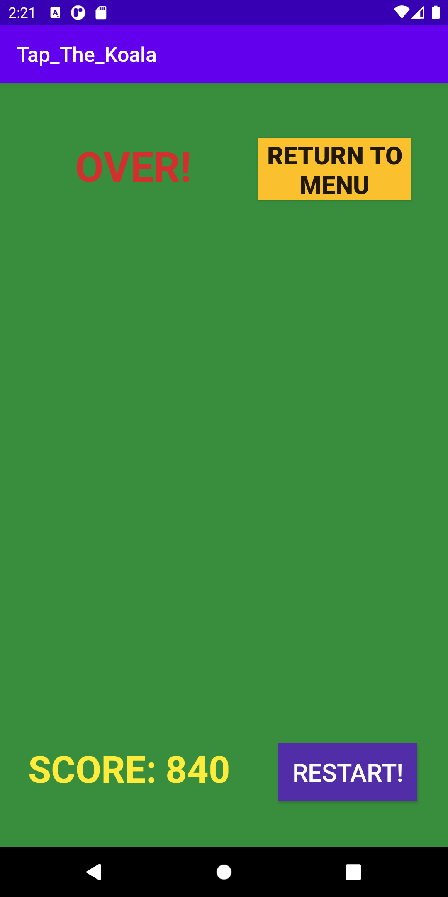
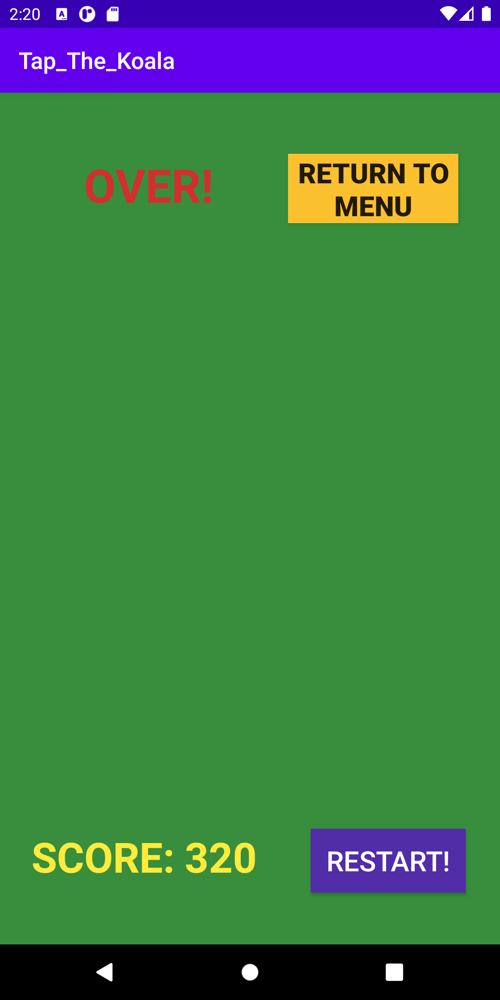
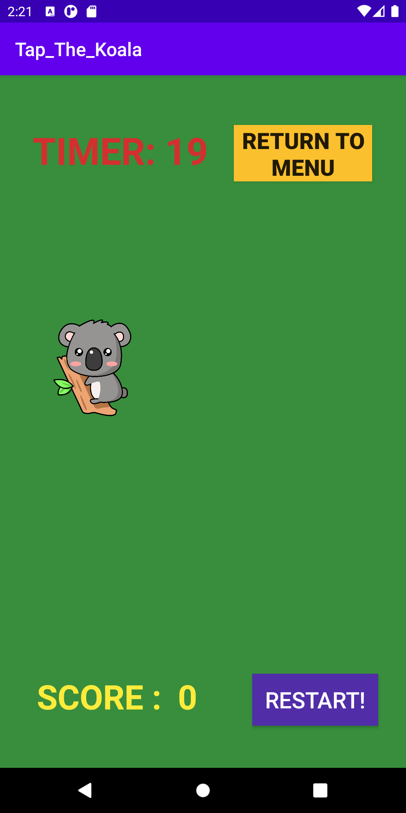

# Tap The Koala Game
## Motivation
With the whole world going under lock down in May-June 2020, everyone is running out of things to do and the situation can result in a lot of stress on an individual. But we all know that gaming releases stress and playing games must be sure-shot stress-buster. I therefore decided to build a game solely for entertainment and to keep a person free of stress in such a case.

## Project Description
The project is based on a **simple 2D game** build on Android Studio using  **Kotlin programming Language**.

It is a simple single player, Tap and Score game. Objective of the game is to tap the character which randomly appears on the screen maximum number of times under the time limit to score the maximum number of points when the time gets over. 

## Level v/s Scoring 
| Difficulty Level | Timer | Score |
| ----------- | ----------- |----------- |
|Easy |50 | 15|
|Medium |30 | 10|
|Hard |20 | 5|

## Screenshots of the Game

| Title | Image | Image |
| ----------- | ----------- |----------- |
|Starting Screen | | NA|
|Easy Mode Game | |  | 
|Medium Mode Game | |  | 
|Hard Mode Game | |  | 
## Results
Our project's main achievement includes the development of an application including:
1. Create a simple and easy game to play in your free time.
2. The game is easy and quick. Also, it can be easily accessible.
3. The game helps also in the development of a few skills such as concentration and focus, as users need to touch
on the character at the right time. 

## Conclusion
The simple single player 2D game intended to give a head start to android game development and to create a simple game using the gained knowledge from the training. The game has a lot of improvements to be done but for now it does its basic functionality and is quite satisfactory for the player. The game developed is compatible with over 92% of the devices and has been tested properly as it progressed. Try to beat your high score, or compete with your friends to see who can tap the fastest!

## Future Scope
In future the app can have an option where the player can choose the character itself from the possible choices which would be displayed on the screen. Also sound effects can be added on various activities and features of the app. A feature can be added to store the score history of the previous gameplays of the player. And after the advancements in the game, the game can be uploaded on the play store